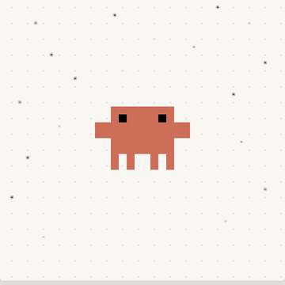
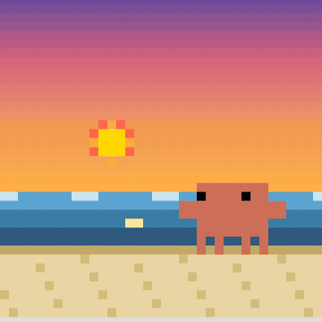
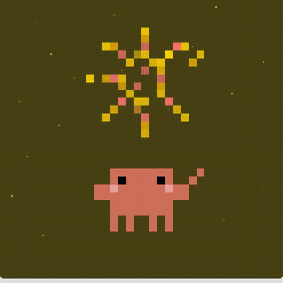

# Clawdy 🦀

<p align="center">
  
</p>

[English](#english) | [中文](#中文)

---

## English

A pixel-art desktop pet crab for macOS (Windows / Linux experimental, untested) — your coding companion while waiting for Claude, with a built-in habit check-in system that shapes its mood.

Clawdy is based on Claude's official mascot Clawd. While Claude is working, watch your little crab buddy do its thing — it makes the wait actually fun. Stick with your check-ins and Clawdy gets visibly happier; slack off and it looks a little down.

### Quick Start

```bash
# Optional (needed for tray icon, global hotkey, Windows music)
pip3 install -r requirements.txt

python3 clawd_pet.py
```

macOS auto-launch via LaunchAgent is supported.

### Controls

| Action | How |
|--------|-----|
| Drag | Left-click and hold |
| Menu | Right-click / Control+click |
| Toggle show/hide | Global `Ctrl+Shift+C` (Windows/Linux only) or tray icon |
| Play / stop music | Menu → 🎵 |
| Next track | Menu → ⏭ |
| Fireworks | Menu → 🎆 |
| Beach / Home | Menu → 🏖 / 🏠 |
| Settle / Wander | Menu → 📍 / 🚶 |
| Check in | Menu → ✅ |
| View progress | Menu → 📊 |
| Manage plans | Menu → 📋 |
| Quit | Menu → Quit |

### Check-In System

A built-in multi-plan habit tracker lives right inside Clawdy (data stored in `checkin.json`).

- **Multiple plans**: create / switch / delete plans, each with its own target count, reward, and start date.
- **One-tap check-in**: pick a plan, optionally leave a short note. Daily duplicates are shown but still allowed per plan.
- **Live progress bar**: Clawdy always wears a tiny pixel progress bar under its feet for the active plan.
- **Milestone fireworks**: when you hit 25% / 50% / 75% / 100%, Clawdy auto-celebrates with fireworks.
- **Streak tracking**: 🔥 7+ days, ⚡ 3+ days, ✨ 1+ day shown in the progress dialog.
- **Undo**: revert the most recent check-in on any plan.

### Mood System

Clawdy's mood is driven by your check-in behavior and biases which idle animations appear:

| Signal | Effect |
|--------|--------|
| Streak ≥ 7 | Much happier (more `dance` / `happy` / `excited`) |
| Streak ≥ 3 | Noticeably happier |
| Progress ≥ 75% | Extra excitement |
| 1–3 days since last check-in | Slightly low |
| 3–7 days since last | Low (more `sleep` / `idle`) |
| 7+ days since last | Visibly sad |

### Animation States

#### Idle States (random auto-switch, mood-weighted)

| State | Description |
|-------|-------------|
| idle | Breathing quietly + occasional blink, eyes track your cursor |
| walk_left / walk_right | Walking sideways — window actually moves (home scene) or walks within the beach |
| dance | Swaying + raising claws + blush + foot particles |
| sleep | Curled up + floating Zzz |
| wave | Waving + heart particles |
| jump | Crouch → jump → bounce + particles |
| working | Coding at a tiny screen + sweating |
| happy | Bouncing + raising claws + floating hearts |
| eating | Find cookie → bite → crumbs → satisfied |
| excited | Fast bouncing + sparkle particles |
| firework | Light fuse → launch → Claude logo burst → afterglow |

#### Claude Code Integration

When you're using Claude Code, Clawdy reflects the work status in real time via an HTTP hook server on port 18900:

| State | Trigger |
|-------|---------|
| thinking | When you send a prompt — thought bubble |
| cc_working | When tools are called — coding at screen |
| error | When a tool fails — shaking + smoke |
| celebrate | When task completes — blush + particles |

#### Companion Awareness

| Behavior | Trigger |
|----------|---------|
| Tilts head at you | Mouse idle for 2 minutes |
| "Drink water" sign | After 45 minutes of continuous work |

### Scenes

<p align="center">
  
  &nbsp;&nbsp;
  
</p>

- **Home** (default): transparent desktop — Clawdy walks across your actual screen.
- **Beach**: pixel sunset scene with animated waves and a reflected sun. Toggle via the menu.

### Settle vs Wander

- **Wander** (default): Clawdy walks freely — the window actually moves around your screen.
- **Settle**: Clawdy stays put, only plays in-place animations.

### Music

Comes with 3 built-in lo-fi tracks. Drop more audio into the `music/` folder:
- Formats: mp3, m4a, wav, aac, flac
- Auto-shuffle, auto-play next
- macOS uses `afplay` (zero deps); Windows uses `pygame` if installed; Linux falls back to `mpv` / `aplay` / `paplay`

### Tech Stack

- **Language**: Python 3 + tkinter
- **Platform**: macOS (tested), Windows / Linux (code paths exist, unverified — PRs welcome)
- **Pixel rendering**: Canvas rectangles, SCALE=6 (each logical pixel = 6×6 screen pixels)
- **Transparent window**: macOS `systemTransparent`, Windows `transparentcolor`, `overrideredirect` everywhere
- **Particle system**: Physics simulation (gravity, velocity, life, decay)
- **Easing**: `ease_out`, `ease_in_out`, `lerp`
- **State machine**: Mood-weighted random transitions, 3–8 seconds per state
- **Check-in storage**: local JSON (`checkin.json`)
- **Claude Code integration**: HTTP server (port 18900) + Claude Code hooks
- **Optional deps**: `pystray` + `Pillow` (tray), `pynput` (global hotkey), `pygame` (Windows audio)
- **Auto-launch (macOS)**: `~/Library/LaunchAgents/com.clawd.pet.plist`

### Auto-Launch Management (macOS)

```bash
launchctl unload ~/Library/LaunchAgents/com.clawd.pet.plist   # disable
launchctl load   ~/Library/LaunchAgents/com.clawd.pet.plist   # enable
```

---

## 中文

macOS 像素风桌面宠物螃蟹（Windows / Linux 代码已写但未实机测试），在你等待 Claude 的时候陪你编程，内置打卡系统，它的心情会随着你的打卡习惯变化。

Clawdy 是基于 Claude 官方吉祥物 Clawd 的桌面小伙伴，等 Claude 干活的时候，看它在旁边忙忙碌碌，让等待变得有趣。坚持打卡，小螃蟹肉眼可见地更开心；偷懒几天，它看起来也会有点蔫。

### 快速启动

```bash
# 可选依赖（托盘图标 / 全局快捷键 / Windows 音乐需要）
pip3 install -r requirements.txt

python3 clawd_pet.py
```

macOS 支持 LaunchAgent 开机自启动。

### 操作方式

| 操作 | 方法 |
|------|------|
| 拖动 | 鼠标左键按住拖 |
| 菜单 | 右键 / Control+点击 |
| 显示/隐藏 | 全局 `Ctrl+Shift+C`（Windows/Linux）或托盘图标 |
| 播放/停止音乐 | 菜单 → 🎵 |
| 切歌 | 菜单 → ⏭ |
| 放烟花 | 菜单 → 🎆 |
| 沙滩 / 回家 | 菜单 → 🏖 / 🏠 |
| 定居 / 游走 | 菜单 → 📍 / 🚶 |
| 打卡 | 菜单 → ✅ |
| 查看进度 | 菜单 → 📊 |
| 管理计划 | 菜单 → 📋 |
| 退出 | 菜单 → 退出 |

### 打卡系统

Clawdy 内置多计划打卡追踪器（数据保存在 `checkin.json`）。

- **多计划管理**：新建 / 切换 / 删除，每个计划有自己的目标次数、奖励、开始日期。
- **一键打卡**：选计划 → 可选留言 → 完成。同一天可重复打，界面会显示"今日已打"。
- **常驻进度条**：小螃蟹脚底一直带着一条像素风进度条，显示当前激活计划的进度。
- **里程碑烟花**：进度达到 25% / 50% / 75% / 100% 时自动放烟花庆祝。
- **连续打卡追踪**：🔥 连续 7 天、⚡ 连续 3 天、✨ 连续 1 天，在进度弹窗顶部显示。
- **撤销**：任意计划最近一次打卡都可撤销。

### 心情系统

Clawdy 的心情会被你的打卡行为影响，进而改变随机状态出现的权重：

| 情况 | 心情 |
|------|------|
| 连续打卡 ≥ 7 天 | 非常开心（`dance` / `happy` / `excited` 增多） |
| 连续打卡 ≥ 3 天 | 明显开心 |
| 进度 ≥ 75% | 额外兴奋 |
| 距离上次打卡 1–3 天 | 稍微低落 |
| 距离上次打卡 3–7 天 | 低落（`sleep` / `idle` 增多） |
| 距离上次打卡 > 7 天 | 肉眼可见的难过 |

### 动画状态

#### 日常状态（按心情加权随机切换）

| 状态 | 描述 |
|------|------|
| idle | 安静呼吸 + 偶尔眨眼，眼睛跟随鼠标 |
| walk_left / walk_right | 横着走——home 场景下窗口真的移动，beach 场景下在画布内来回 |
| dance | 左右摇摆 + 举钳子 + 腮红 + 脚底粒子 |
| sleep | 缩成一团 + 飘浮 Zzz |
| wave | 挥手 + 爱心粒子 |
| jump | 蓄力压扁→起跳→落地弹跳 + 粒子 |
| working | 面对小屏幕写代码 + 冒汗 |
| happy | 弹跳 + 举双钳 + 飘浮爱心粒子 |
| eating | 发现饼干→一口口咬→掉碎屑→满足 |
| excited | 快速蹦跳 + 闪光粒子 |
| firework | 点燃→上升→Claude logo 米字形绽放→余韵→欢呼 |

#### Claude Code 联动状态

使用 Claude Code 时，小螃蟹通过 HTTP hook server（端口 18900）实时反映工作状态：

| 状态 | 触发时机 |
|------|----------|
| thinking | 发送 prompt 时，头顶思考气泡 |
| cc_working | 调用工具时，面对屏幕写代码 |
| error | 工具报错时，身体颤抖 + 冒烟 |
| celebrate | 任务完成时，腮红 + 粒子庆祝 |

#### 小伙伴关心

| 行为 | 触发条件 |
|------|----------|
| 歪头看你 | 鼠标 2 分钟没动 |
| 喝水提醒 | 连续工作 45 分钟，头顶举起"喝水"小牌子 |

### 场景切换

<p align="center">
  
  &nbsp;&nbsp;
  
</p>

- **Home**（默认）：透明桌面——小螃蟹在你真实的屏幕上横着走。
- **Beach**：像素风日落沙滩，带动画海浪和夕阳倒影。菜单切换。

### 定居 vs 游走

- **游走**（默认）：窗口会真的在屏幕上移动。
- **定居**：小螃蟹留在原地，只做原地动画。

### 音乐播放

内置 3 首 lo-fi 轻音乐，开箱可用。更多音频文件放到 `music/` 文件夹：
- 支持格式：mp3、m4a、wav、aac、flac
- 自动随机播放，播完自动下一首
- macOS 用自带 `afplay`（零依赖）；Windows 优先用 `pygame`；Linux 尝试 `mpv` / `aplay` / `paplay`

### 技术架构

- **语言**：Python 3 + tkinter
- **平台**：macOS（已测试）、Windows / Linux（代码已写但未验证，欢迎帮忙测试 PR）
- **像素绘制**：Canvas rectangles，SCALE=6（每个逻辑像素 6×6 屏幕像素）
- **透明窗口**：macOS `systemTransparent`、Windows `transparentcolor`，全平台 `overrideredirect`
- **粒子系统**：物理模拟（重力、速度、生命周期、衰减）
- **缓动函数**：`ease_out`、`ease_in_out`、`lerp`
- **动画状态机**：心情加权随机切换，每种状态 3–8 秒
- **打卡存储**：本地 JSON（`checkin.json`）
- **Claude Code 联动**：HTTP server（port 18900）+ Claude Code hooks
- **可选依赖**：`pystray` + `Pillow`（托盘）、`pynput`（全局快捷键）、`pygame`（Windows 音频）
- **开机自启（macOS）**：`~/Library/LaunchAgents/com.clawd.pet.plist`

### 开机自启动管理（macOS）

```bash
launchctl unload ~/Library/LaunchAgents/com.clawd.pet.plist   # 取消
launchctl load   ~/Library/LaunchAgents/com.clawd.pet.plist   # 恢复
```

---

## File Structure

```
clawdy/
├── clawd_pet.py          # Main program
├── requirements.txt      # Optional deps (tray / hotkey / Windows audio)
├── checkin.json          # Check-in data (auto-generated)
├── music/                # Music folder (3 built-in tracks)
│   └── *.mp3
├── screenshots/          # README assets (GIFs)
├── dancing-clawd.html    # Clawd dancing animation (standalone)
├── sunset-beach.html     # Sunset beach animation (standalone)
├── STORY.md              # The story behind Clawdy
└── README.md
```
